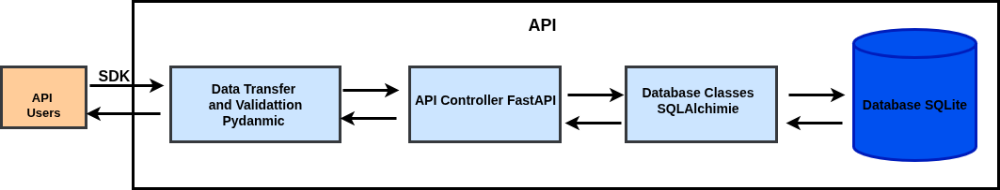
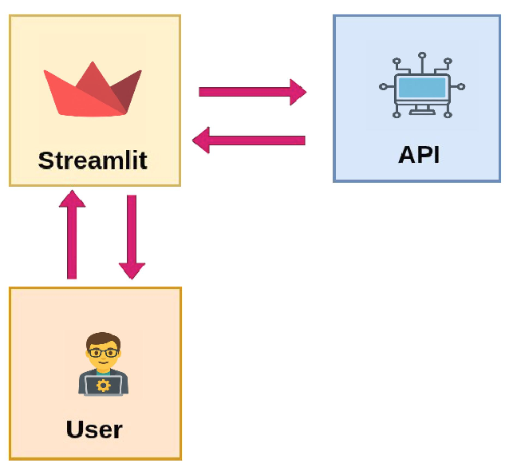
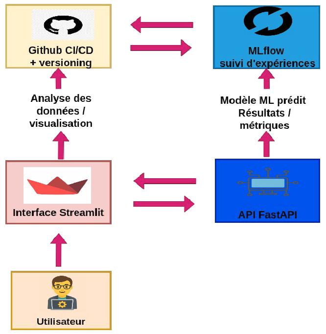

# ✨ CineData Insights : Un Projet Data Complet au Service de l'Industrie Cinématographique

## 🚀 Mission : Construire un Écosystème Data Cinématographique avec Python, FastAPI et Streamlit

### 🎥 Plongée dans le monde du Cinéma & de la Data Science

**CineData Insights** est une initiative ambitieuse visant à repenser l’analyse cinématographique à l’ère de la data. L’idée ? Créer une plateforme intelligente pour les plateformes de streaming, les cinéphiles et les studios de production, à partir de données issues du célèbre dataset MovieLens.

Mais le départ est chaotique : des fichiers CSV non liés, des données déstructurées, aucun moyen centralisé pour les exploiter efficacement.

> ✅ **Mon rôle ? Transformer ce chaos en un écosystème analytique fluide, moderne et scalable.**

Ce projet s'articule autour de trois grandes compétences que j'ai successivement mobilisées :

---

## 🔹 Phase 1 : Développement d’une API Python & SDK

### 🛠️ Objectif : Centraliser et exposer les données MovieLens via une API robuste et un SDK Python

- 🔢 **Modélisation relationnelle** en SQLite : conception des tables, intégration des fichiers `movies`, `ratings`, `tags`, `links`
- 📁 **API RESTful** avec FastAPI, SQLAlchemy et Pydantic pour structurer les requêtes
- 🚌 **Déploiement sur Render** (et Docker pour usage local)
- 🔹 **Création d’un SDK Python professionnel**, publié sur PyPI, pour accéder facilement à l’API

### 💼 Livrables
- API documentée (Swagger/ReDoc)
- SDK Python `alimiji_film_sdk` utilisable dans tout projet
- Données MovieLens intégrées dans une base relationnelle efficace

---

## 🔹 Phase 2 : Exploration & Visualisation Interactive

### 📊 Objectif : Explorer, visualiser et partager les insights extraits via l’API

- 📊 **Exploration interactive** : tendances de notes, genres populaires, préférences utilisateurs
- 📄 **Application Streamlit** connectée au SDK/API, avec tableaux dynamiques et visualisations Plotly
- 📷 **Intégration d’images de films (OMDb)**

### 💼 Livrables
- App Streamlit web-ready
- Dashboards interactifs et dynamiques
- Notebook d’analyse exploratoire

---

## 📚 Dataset MovieLens : un standard pour les recommandations

- **movies.csv** : titres, genres  
- **ratings.csv** : évaluations utilisateurs (note + timestamp)  
- **tags.csv** : mots-clés assignés aux films  
- **links.csv** : identifiants IMDB et TMDb  

Structure modélisée dans SQLite avec relations clés primaires/étrangères, assurant l’intégrité et facilitant les requêtes analytiques.

---

## 🏗️ Architecture API expliquée (Phase 1)

Le backend repose sur une chaîne d'outils solide :

1. 🧳 **SDK Python** : interface utilisateur de l’API  
2. 📘 **Pydantic** : validation des entrées  
3. ✨ **FastAPI** : cœur de la logique applicative  
4. 📊 **SQLAlchemy** : ORM pour requêtes sécurisées  
5. 💾 **SQLite** : stockage local relationnel  

> **Métaphore** : comme un client qui commande via une tablette (SDK), la cuisine (FastAPI) traite sa commande et va chercher les ingrédients dans la réserve (SQLite).

---

## 📦 Publication du SDK Python

- SDK : `alimiji_film_sdk` disponible sur [PyPI](https://pypi.org/project/alimiji-film-sdk/0.0.5/)
- Documentation claire avec exemples de code
- Possibilité d’importer dans n’importe quel projet Python

---

## 📈 Compétences mises en œuvre

| Compétence         | Technologies                        |
|--------------------|-------------------------------------|
| API Design         | FastAPI, Swagger, Pydantic          |
| Data Modeling      | SQLite, SQLAlchemy                  |
| DevOps             | Docker, Render                      |
| SDK Packaging      | PyPI, setuptools, `pyproject.toml`  |
| Visualisation      | Streamlit, Plotly, Pandas           |
| MLOps *(à venir)*  | MLflow, Airflow, SVD, autoencoders  |

---

## 🔍 Conclusion : Un Projet Complet, Mûr et Impactant

Ce projet est bien plus qu’un exercice technique :

- 🌟 Il prouve ma capacité à **construire un écosystème data de A à Z**
- 🚀 Il montre ma maîtrise des **standards modernes en Data Engineering et API Design**
- 🛠️ Il met en avant des compétences **déployables en entreprise** : dev, analyse, doc, packaging, déploiement

> Si vous cherchez un profil **technique, rigoureux et capable de livrer**, ce projet est une démonstration concrète.

---
---

## 🔹 Phase 3 : Systèmes de Recommandation & MLOps

### 🎯 Objectif : Déployer un moteur de recommandation intelligent, automatisé et maintenable

Cette dernière phase du projet CineData Insights vise à construire un moteur de recommandation de films et à industrialiser le pipeline avec les outils MLOps modernes.

---

### 🧠 Construction du moteur de recommandation

- 📊 **Préparation des données utilisateurs-films** à partir des notes extraites via l’API
- 🧮 **Techniques utilisées** :
  - **Filtrage collaboratif** (User/Item-Based)
  - **Factorisation matricielle (SVD)**
  - **Autoencoders** pour la réduction de dimensionnalité
  - **LightFM** pour les cas hybrides (contenu + interactions)

- 🎯 **Évaluation** :
  - Précision, rappel, RMSE, NDCG sur set de validation
  - Tests croisés pour validation robuste

---

### ⚙️ Mise en place du pipeline MLOps

- 🛠️ **Tracking des expériences** avec **MLflow**
- 🔄 **Automatisation des tâches** avec **Airflow** :
  - Ingestion de nouvelles données MovieLens
  - Prétraitement, entraînement, déploiement du modèle

- 📦 **Conteneurisation avec Docker** du modèle et de l’API prédictive
- ☁️ **Déploiement cloud** (Render ou AWS Lambda)
- 🔁 **Répétabilité et CI/CD** via GitHub Actions

---

### 💼 Livrables

- Moteur de recommandation personnalisable en Python
- API FastAPI exposant des prédictions top-N
- Workflow Airflow et pipelines reproductibles
- Tableau de bord de suivi avec MLflow
- Conteneur Docker prêt à déployer

---

## 🧩 Architecture technique (Phase 3)

| Composant            | Rôle                                 |
|----------------------|--------------------------------------|
| API Reco (FastAPI)   | Servir les prédictions via REST      |
| Modèles SVD/Autoenc. | Recommander des films personnalisés  |
| MLflow               | Tracking des performances            |
| Airflow              | Orchestration des tâches             |
| Docker               | Packaging pour déploiement           |
| CI/CD                | Mises à jour automatisées            |

---

### 🔓 Ouverture possible

- 🔍 Intégration de feedback en ligne (réentraînement continu)
- 🧠 Passage à des modèles plus complexes : Transformers, RecoBERT
- 📱 Développement d’une app mobile connectée à l’API

---

### ✅ Compétences mobilisées

- Systèmes de recommandation (collaboratif, hybride)
- Machine Learning (SVD, Autoencoder, LightFM)
- MLOps (MLflow, Airflow, Docker, CI/CD)
- Déploiement cloud et architecture modulaire

---

> 🎬 **Conclusion** : Cette phase positionne CineData Insights comme une plateforme intelligente et scalable, capable d’offrir des recommandations pertinentes à grande échelle, avec un pipeline automatisé et maintenable.

